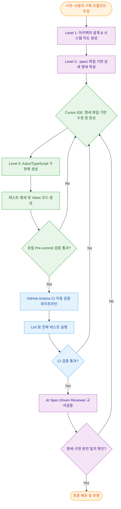
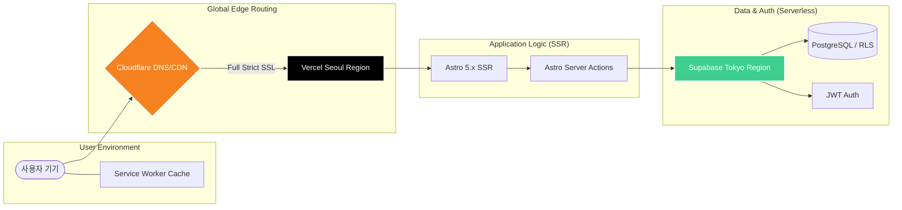

# nmstats

이 프로젝트는 **핵의학 진료통계 조회**를 위한 시스템을 **Astro(SSR)와 Supabase** 기반으로 구축한 PWA(Progressive Web App) 입니다. 오프라인 상태에서도 작동하며 빠른 속도를 제공하도록 설계되었습니다.

---

## AI Software Development Life Cycle (AI-SDLC)

본 프로젝트는 기획 단계부터 배포까지 AI 에이전트와의 적극적인 협업을 통해 높은 품질과 생산성을 보장하는 **AI-Native Spec-Driven Development** 워크플로우를 채택하고 있습니다. 명세(`.spec/`)를 중심으로 구현과 검증이 순환하는 자동화된 파이프라인 개발 경험을 제공합니다.

### 개발 워크플로우 및 검증 루프

1.  **AI 기획 및 설계 (AI Planning)**: [AGENTS.md](../AGENTS.md)를 통해 시스템 지도를 먼저 정의하고, 모든 구현체 전에 `.spec/` 디렉토리에 명세를 먼저 작성합니다.
2.  **명세 주도 개발 (Spec-Driven with Cursor)**: 작성된 명세 파일을 Cursor IDE에 전달하여 사용자와 AI가 명세의 디테일을 완성합니다. 완성된 명세를 바탕으로 1:1로 매칭되는 실행 파일을 생성한 뒤, Vitest를 위한 테스트 명세 및 실제 테스트 코드를 작성합니다. 테스트를 통과해야만 명세에 대한 구현 파일이 올바르게 만들어진 것으로 간주합니다.
3.  **CI 검증 & AI 교차 리뷰 (CI & AI Review)**: 모든 실행 파일 개발이 완료되어 GitHub에 코드가 푸시되면, CI 파이프라인에서 Lint 및 전체 테스트가 진행됩니다. 모든 CI 테스트를 통과하면 마지막으로 **AI Spec-Driven Reviewer** 동작을 통해 명세와 실행 파일이 애초의 계획과 의도대로 정확히 작성되었는지 교차 검증을 수행합니다.

---

## 핵심 기능 및 설계 철학

### 📊 핵의학 진료통계 조회

핵의학과의 진료통계 데이터를 실시간으로 조회하고 분석할 수 있는 환경을 제공합니다.

- **반응형 UI**: 스마트폰, 태블릿, PC 등 다양한 디바이스에서 최적화된 통계 화면을 제공합니다.
- **PWA 지원**: 주요 페이지 캐시를 통한 읽기 전용 오프라인 접근이 가능합니다.
- **인증 기반 접근**: Supabase Auth를 통해 인가된 사용자만 통계 데이터에 접근할 수 있습니다.

### ⚡ 최고의 성능을 위한 인프라 아키텍처

사용자가 어디에 있든 1초 이내에 페이지를 경험할 수 있도록 엣지(Edge) 기반의 고성능 아키텍처를 구성했습니다.

- **지연 시간 최적화**: Vercel 서울 리전과 Supabase 도쿄 리전을 결합하여 성능 저하 없는 SSR 환경을 구축했습니다.
- **보안 아키텍처**: Cloudflare Full (Strict) SSL과 Supabase RLS(Row Level Security)를 통해 의료 데이터급 보안을 유지합니다.

---

## 포함된 기능

### 코드 품질 및 테스트

- **린터·포매터**: ESLint, Prettier — `npm run lint`, `npm run format`
- **타입 검사**: TypeScript — `npm run check`
- **커밋 전 검사**: Husky + lint-staged — 타입 체크 및 단위 테스트 자동 실행
- **테스트**: Vitest (Unit), Playwright (E2E) — `npm run test:unit`, `npm run test:e2e`
- **CI/CD**: GitHub Actions — 자동 빌드, 테스트, AI Spec Review 및 Vercel 자동 배포

### 주요 기술 스택

- **프레임워크**: Astro 5.x (SSR 전용, PWA)
- **백엔드 서비스**: Supabase (Auth, DB, Storage)
- **상태 관리**: Nanostores (Persistent 스토어 지원)

---

## 프로젝트 구조

| 경로              | 설명                                           |
| ----------------- | ---------------------------------------------- |
| `src/pages/`      | 라우팅 및 페이지 컴포넌트 (SSR 강제)           |
| `src/actions/`    | 서버 사이드 비즈니스 로직 (Astro Actions)      |
| `src/lib/`        | DB 클라이언트, 유틸리티                        |
| `src/components/` | 재사용 가능한 UI 컴포넌트                      |
| `.spec/`          | 파일별 1:1 매핑 명세서 (Level 2)               |
| `sql_query/`      | DB 스키마 통합 관리 (`rebuild_all_tables.sql`) |
| `tests/`          | 단위(Unit) 및 종단 간(E2E) 테스트 코드         |

---

## 상세 가이드 및 유지보수 참조 (Maintenance Documents)

프로젝트의 지속적인 운영과 기술적 세부 사항 파악을 위해 `documents/` 디렉토리에 다음 가이드들을 보관하고 있습니다. 특히 외부 서비스 설정 가이드는 운영 중 필수적으로 참조해야 할 자산입니다.

### 인프라 및 설정

- **[외부 서비스 설정 가이드](external_services_guide.md)**: **(운영 필수)** Supabase, Vercel, Cloudflare 등의 연동 및 환경 설정 체크리스트
- **[데이터베이스 설계](database_schema.md)**: 전체 테이블 구조, RLS 정책 및 데이터 관계 정의

### 개발 및 코드 품질

- **[코드베이스 가이드](codebase_guide.md)**: 상세 파일별 기술적 역할 및 시스템 설계 가이드. 개별 명세(`.spec/`)는 AI 에이전트 전용으로 작성되어 가독성이 낮을 수 있으므로, 유지보수 목적의 코드 역할 파악은 이 가이드라인을 참조할 것을 권장합니다.
- **[테스트 전략](test_strategy.md)**: QA를 위한 테스트 시나리오 및 수동 점검
- **[로깅 가이드](logging_guide.md)**: 모듈별 로그 위치 및 보안 가이드

---

## 라이선스 및 이용 안내

본 프로젝트는 의료 통계 정보의 접근성 향상과 AI 기반 개발 표준의 확산을 위해 공개되었습니다.

- **비상업적 목적**: 교육, 연구 및 개인적 용도의 활용은 자유롭게 허용됩니다.
- **상업적 목적**: 본 프로젝트의 아키텍처, 명세 구조 또는 코드를 상업적 서비스에 인용하거나 재배포하려는 경우, 반드시 저작권자와의 사전 협의 및 서면 승인이 필요합니다.
